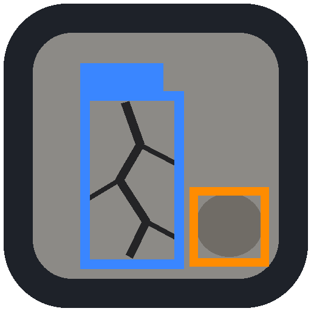
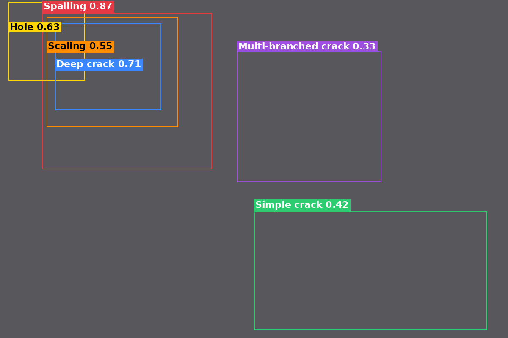

<div align="center">



# post-earthquake concrete crack defects (PECCD)-Detect

**Automated multi-class detection of post-earthquake concrete defects**

Companion software for the paper
*Multitype concrete defect detection using the new post-earthquake concrete crack dataset and extended YOLO approach*

[](LICENSE)
[](https://www.python.org/)
[](https://doi.org/10.17632/w7549ryvx2.1)

</div>

---

## Overview

After an earthquake, thousands of photographs of damaged concrete surfaces have to be
reviewed before a structure can be declared usable, restricted or unsafe. PECCD-Detect
automates the first stage of that review. It takes a field photograph and returns the
location and the category of every visible defect, together with a quantitative summary
that can be exported for further assessment.

The tool runs the **YOLOV12SDSDA** detector — a YOLOV12S backbone extended with a
depthwise-separable dual-attention (DS-DA) module — trained on the **Post-Earthquake
Concrete Crack Dataset (PECCD)**, which was collected along the Syrian coast after the
February 2023 earthquake.

Six deterioration mechanisms are localised and classified:

| Colour | Category | Description |
|:---:|---|---|
| 🟧 | **Scaling** | Progressive loss of surface mortar |
| 🟥 | **Spalling** | Detachment of concrete fragments from the surface |
| 🟪 | **Multi-branched crack** | Crack network with several branches |
| 🟩 | **Simple crack** | Single, surface-level crack |
| 🟦 | **Deep crack** | Crack penetrating the concrete section |
| 🟨 | **Hole** | Through-opening or cavity |

Unlike the binary crack / no-crack tools that dominate the literature, PECCD-Detect
distinguishes between deterioration mechanisms and handles scenes in which several of
them occur simultaneously — which is the normal case in post-earthquake imagery.

---

## Screenshot

<div align="center">

</div>

---

## Quick start — for engineers and researchers (no programming required)

You do **not** need Python, a notebook environment or an internet connection.

1. Go to the [**Releases**](../../releases) page and download:
   * `PECCD-Detect-win64.zip` — the ready-to-run Windows application
   * `bestV12CrackClass.pt` — the trained model weights
2. Extract the ZIP anywhere (Desktop is fine). No installation is performed and nothing
   is written to the registry.
3. Double-click **`PECCD-Detect.exe`**.
4. In the application: *Browse .pt* → select the downloaded weights → *Load model*.
5. *Select image(s)…* or *Select folder (batch)…*, then press **RUN DETECTION**.

A complete walkthrough with screenshots is in **[docs/USER_GUIDE.md](docs/USER_GUIDE.md)**.

> **Windows SmartScreen** may warn that the publisher is unknown, because the executable
> is not code-signed. Choose *More info → Run anyway*. This is expected for unsigned
> academic software.

---

## Quick start — from source

```bash
git clone https://github.com/<your-account>/PECCD-Detect.git
cd PECCD-Detect
pip install -r requirements.txt
# Linux only: sudo apt-get install python3-tk
python src/PECCD_Detector_GUI.py --weights models/bestV12CrackClass.pt
```

---

## What the application does

**Detection**
* Loads any Ultralytics-compatible checkpoint, including both the unmodified YOLO
  baselines and the proposed DS-DA model
* Automatic GPU selection with transparent fallback to CPU
* Single-image and full-folder batch modes
* Live control of the confidence threshold, the NMS IoU threshold and the inference
  resolution — no script editing

**Visualisation**
* One colour per defect category, with the category name and confidence score drawn on
  each bounding box
* Automatic label placement that avoids overlaps in cluttered scenes
* Per-category visibility switches, so a single deterioration mechanism can be isolated
* Side-by-side comparison with the unannotated original

<div align="center">

</div>

**Quantitative output**
* Instance count, mean confidence and percentage of imaged surface per category
* Dominant defect by surface extent, and per-image inference time
* Export to annotated PNG, YOLO-format labels, per-image CSV, cumulative session CSV,
  or a full batch run writing every annotated image plus `PECCD_batch_report.csv`

---

## The PECCD dataset

| Property | Value |
|---|---|
| Images | 1,180 |
| Annotated instances | 4,201 |
| Categories | 6 |
| Acquisition | 5 mobile phone cameras, July–October 2024 |
| Locations | 10+ sites along the Syrian coast (Feb. 2023 earthquake) |
| Resolutions | 487×1080 up to 4064×3048 |
| Annotation tool | LabelImg, YOLO format |
| Inter-annotator agreement | mean IoU 0.918, class agreement 0.920 |

No imaging constraints were imposed during collection. The dataset deliberately retains
background clutter, crack-like objects (cables, pipes, reinforcement bars, wall
writing), strong illumination variation and multiple defect categories within a single
scene.

**Download:** [https://doi.org/10.17632/w7549ryvx2.1](https://doi.org/10.17632/w7549ryvx2.1)

---

## Results

Ten object-detection models were trained on PECCD under identical settings (75 epochs,
batch 32, lr 0.001, Adam, 640×640). The proposed DS-DA modification improves every
metric over its YOLOV12S baseline without additional training cost:

| Model | Precision | Recall | mAP50 | mAP50-95 |
|---|:---:|:---:|:---:|:---:|
| YOLOV12S (baseline) | 0.707 | 0.566 | 0.644 | 0.414 |
| **YOLOV12SDSDA (proposed)** | **0.767** | **0.668** | **0.719** | *see paper* |
| RT-DETR | 0.702 | 0.573 | 0.608 | 0.369 |
| YOLOV11M | 0.650 | 0.592 | 0.633 | 0.416 |
| YOLOV10S | 0.665 | 0.601 | 0.634 | 0.399 |

Relative to YOLOV12S, the proposed model gains **+6.0 % precision, +10.2 % recall and
+7.5 % mAP50**. The recall gain matters most for inspection: a missed detection means an
underestimated level of deterioration.

<!-- Fill in the mAP50-95 value for YOLOV12SDSDA from Table 8 of the manuscript
     before publishing the repository. -->

---

## Known limitations

Stated openly, because they determine what the tool can responsibly be used for:

* **Still images only.** No video, live-stream or UAV feed input.
* **No metric calibration.** Output is in the pixel domain; crack width in millimetres
  cannot be recovered without a scale reference or a calibrated acquisition. The
  reported surface percentage is an extent proxy, not a measurement.
* **Bounding-box geometry.** Axis-aligned rectangles overestimate the damaged area of
  thin, diagonally oriented cracks.
---

## Documentation

| Document | Contents |
|---|---|
| [docs/USER_GUIDE.md](docs/USER_GUIDE.md) | Step-by-step guide for non-programmers |
| [docs/TROUBLESHOOTING.md](docs/TROUBLESHOOTING.md) | Common errors and their fixes |
| [build/BUILD.md](build/BUILD.md) | How to rebuild the Windows executable |
| [docs/LICENSING_NOTE.md](docs/LICENSING_NOTE.md) | Why this repository is AGPL-3.0 |

---

## Citation

If you use this software, the dataset or the model, please cite:

```bibtex
@article{Mayya_PECCD,
  title   = {Multitype concrete defect detection using the new post-earthquake
             concrete crack dataset and extended YOLO approach},
  author  = {Mayya, Ali and Alkayem, Nizar and Saii, Mariam and
             Ahmad, Maha Haydar and Bayat, Mahmoud and Asteris, Panagiotis G. and
             Cao, Maosen},
  journal = {Nondestructive testing and evaluation},
  year    = {2026}
}

@misc{PECCD_dataset,
  title     = {Post-Earthquake Concrete Crack Dataset (PECCD)},
  author    = {Mayya, Ali and Alkayem, Nizar},
  year      = {2025},
  publisher = {Mendeley Data},
  doi       = {10.17632/w7549ryvx2.1}
}
```

---

## Licence

This project is released under the **GNU Affero General Public License v3.0**, because it
builds on the Ultralytics YOLO framework, which is itself AGPL-3.0. See
[docs/LICENSING_NOTE.md](docs/LICENSING_NOTE.md) for what this means in practice, both for
this repository and for anyone who redistributes the executable.

The PECCD dataset is distributed separately under the terms stated on its
[Mendeley Data record](https://doi.org/10.17632/w7549ryvx2.1).

---

## Acknowledgements

This work was supported by the Research Fund for International Young Scientists of the
National Natural Science Foundation of China (No. 52250410359), the Natural Science
Research Start-up Foundation of Recruiting Talents of Nanjing University of Posts and
Telecommunications (No. NY223176), and the Jiangsu–Czech Bilateral Co-funding R&D
Project (No. BZ2023011).

The annotation of the dataset was carried out by two civil engineering specialists and
supervised by the authors.
